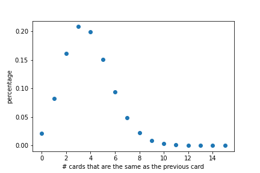

# How many times can we expect the latest drawn card to be the same as the previous card?

Answer: 99% of the games will have at most __nine cards__ that are the same as the previous card. Assuming all 82 cards are drawn.

